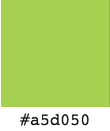

# Future Leaders

An organisation to help develop future leaders by connecting alumni with their past schools and arranging inspiring talks.

# Why

Future leaders sought to raise extra revenue to help the organisation, and sought to minimise the workload for the user when making donations. The seals of approval were tasked with helping to solve the problem.

# What

A website to enable secure online payments.

# Who

Donors/potential donors of Future Leaders

[View prototype on InVision](https://invis.io/Y79R7D856#/211438587_Landing_Page)

# Style Guide

## Colours

There are 3 key colours used throughout the website.

- Green logo colour: #a5d050
- Grey logo colour: rgb(150,150,150) or #969696
- Grey box outlines on payment page and payment-confirmation pages: #BDBDBD

## Font

  - **Main font:** Roboto
  - **Landing page header:** Open Sans
