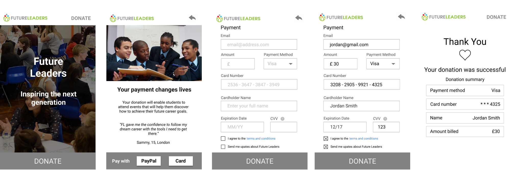

## Summary of User Testing Findings

- 5 user tests
- Focus: usability of online donation flow
- Took place using website prototype on inVision app

### User profiles
- Range of ages from 20s to 60s
- Range of technological proficiencies
- Mix of genders
- All users identified as alumni
- All users given the same objective of making an online donation using a card payment
- All users tested on mobile

### Things to keep
- No need to scroll
- Not too cluttered
- Short process
- Page 2 content: Telling user where their money is going, knowing they will make a difference (++)
- Images to add human touch
- Mailing list is optional

### Things to change
- Add an email confirmation notification on payment complete page (+++)
- Add colour and vibrance to website, particularly buttons (++)
- After thank you, option to see details about how money is being used (++)
- Help button on last page (++)
- Heart animation on click adds colour (++)
- Change 'Pay with' to 'Donate with' for added warmth (+)
- A donation reference number (+)
- Added message on payment page to make it warmer (+)
- Add higher contrast buttons (+)
- Indicate card payment is secure (+)
- Too much text/ too small on page 2 (+)
- No donate button on last page (+)
- Option to take a photo of your card to autofill the details (+)
- Order of payment details/email address being at top (+)
- More willing to sign up to mailing list if it is about updates about where their money is going (+)

### Other
- Previous user online donation experiences: Children in Need, Just Giving, Virgin Money Giving
